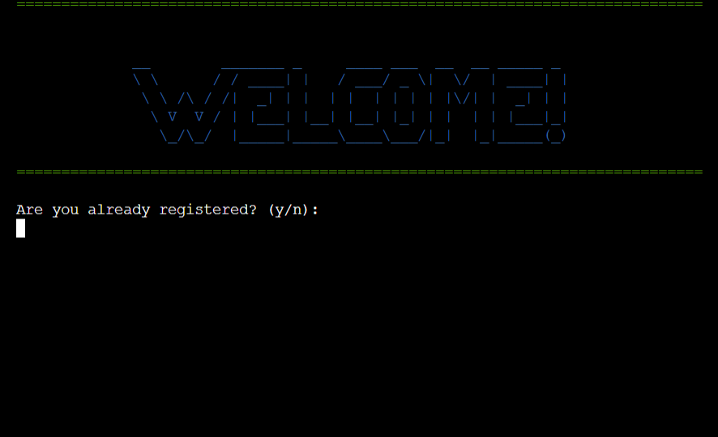
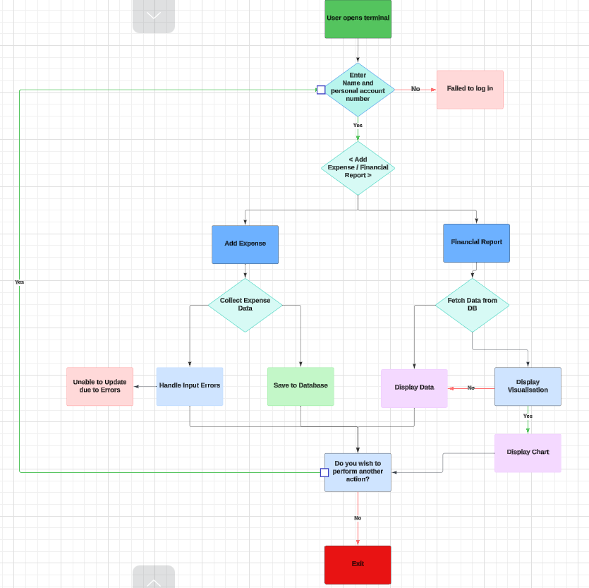

# Expense Tracker

Welcome to the Expense Tracker Application, a robust and user-friendly tool designed to help you manage and monitor your personal finances efficiently. This application leverages Google Sheets for data storage, providing a seamless way to log, categorize, and track your expenses. With features that allow users to register, log in, add expenses, generate detailed reports, and manage expense categories, this tool is perfect for individuals looking to gain better control over their financial habits. The application also includes functionalities to list all expenses and delete specific entries, ensuring that users can maintain accurate and up-to-date financial records. Whether you're tracking daily expenditures or managing monthly budgets, the Expense Tracker Application offers the flexibility and convenience needed to stay on top of your finances.

## Why the expense tracker? 

An application that can track expenses, log them and calculate by category and time could be incredibly useful to the right user. Many people struggle with logging expenses, sometimes spending much more than they were thinking. An application such as this could help eliminate this issue and allow people to take back control of their spending. 

**Note** This app is for educational and recreational purposes only. Please do not enter any critical information pertaining to bank details. 

[Deployed Project](https://financial-expense-tracker-602c9c911447.herokuapp.com/)

**Table of Contents**
- [Creation Structure](#creation-structure)
- [User Experience](#user-experience)
- [Goals](#goals)
- [Features](#features)
  - [Validation Errors](#validation-errors)
- [Design](#design)
- [Future Deployment](future_deployment)
- [Testing](#testing)
- [Bugs](#bugs)
- [Deployment](#deployment)
- [Credits](#credits)
  - [Libraries](#libraries)

## Creation Structure

Due to constraints when it comes to python in the terminal, I opted to show a table of expenses rather than charts as was initially planned.

## User-Experience

Users who use this app will have specific goals in mind. While The Expence Tracker does not control your expenses, it logs them, allowing you to see how much and where your money is going. 

As a user some of the things I look for is: 
- A friendly and accomodating interface
- A unique identifier so I can log in and out of the application at my own will
- Be redirected back to the prompt, each time I enter a wrong input
- Be clearly shown when an input is correct or incorrect using colors on validation
- Be able to log my expenses by amount, date and category
- Show my expenses by month and category, and the aggregate of my expenditure for each category within the month in a table
- Be able to return back a step if I input the wrong decision
- Be able to delete an expense I have logged
- Be able to see all expenses in a a table

## Goals

A user who uses this app has a clear goal in mind. Get control of expenditure. A user who commits to using this app will hope to log and keep track of where their money goes each month, and make necessary changes to this if needed. 

## Features
### Login Feature

### Validation Errors

## Design

## Future Deployment

## Testing

## Deployment

This site is deployed using Heroku and following these steps:

- Create a Heroku account or, if you already have one, sign in
- Click the 'new' button and select 'create new app'
- Enter a unique name for your app and choose the region you are in
- Click 'create app'
- Click 'settings' and scroll down to 'Config Vars'. Click 'reveal Config Vars'
- In the box with the text 'KEY' type PORT and 8000 in the box with the text 'VALUE'
- Scroll to the next section, buildpacks and click 'add buildpack'. Add Python and NodeJS, in that order. Click 'Add Buildpack'
- Scroll back to the top of the page and click 'Deploy'
- Scroll to the Deployment method and choose Github
- In the next section, Connect to Github, type in your repository name. If you press the search button it'll bring up all your repositories. 
- Connect to the correct repository
- Scroll down to the two sections for deployment (automatic deploys or manual deploys). The automatic deplays will update each time the 'git push' command is entered. For the maunal deploy, this will deploy the branch specified, in it's current state, when the 'Deploy Branch' button is clicked
- Back to top

### Forking the project

## Credits
### General Credits
- ChatGPT used to show the report back to the user as this syntax was foreign to me
- [StackOverflow](https://stackoverflow.com/) used to answer questions I encountered with bugs and adding colors to the project

### Libraries
**[gspread](https://docs.gspread.org/en/v6.0.1/)** - Google Sheets Python API.
  - **Repository:** [gspread on GitHub](https://github.com/burnash/gspread)
  - **Documentation:** [gspread Documentation](https://gspread.readthedocs.io/en/latest/)

**[pandas](https://pandas.pydata.org/)** - Data analysis and manipulation
  - **Repository:** [pandas on GitHub](https://github.com/pandas-dev/pandas)
  - **Documentation:** [pandas Documentation](https://pandas.pydata.org/pandas-docs/stable/)

**[colorama](https://pypi.org/project/colorama/)** - Colored text API
  - **Repository:** [colorama on GitHub](https://github.com/tartley/colorama)
  - **Documentation:** [colorama Documentation](https://pypi.org/project/colorama/)

**os** - Part of the Python Standard Library for interacting with the operating system
  - **Documentation:** [os Documentation](https://docs.python.org/3/library/os.html)

**time** - Part of the Python Standard Library for time-related functions (used for sleep())
  - **Documentation:** [time Documentation](https://docs.python.org/3/library/time.html)

**datetime** - Part of the Python Standard Library
  - **Documentation:** [datetime Documentation](https://docs.python.org/3/library/datetime.html)

### Specific Credits
**Clear()** function - [Geeks for Geeks](https://www.geeksforgeeks.org/clear-screen-python/)