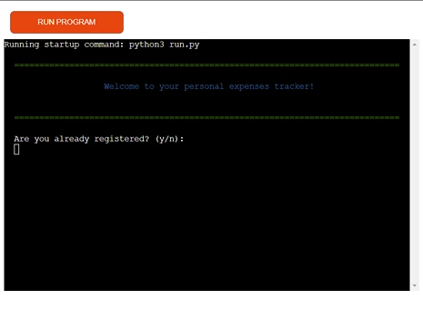

# Expense Tracker

Welcome to the Expense Tracker Application, a robust and user-friendly tool designed to help you manage and monitor your personal finances efficiently. This application leverages Google Sheets for data storage, providing a seamless way to log, categorize, and track your expenses. With features that allow users to register, log in, add expenses, generate detailed reports, and manage expense categories, this tool is perfect for individuals looking to gain better control over their financial habits. The application also includes functionalities to list all expenses and delete specific entries, ensuring that users can maintain accurate and up-to-date financial records. Whether you're tracking daily expenditures or managing monthly budgets, the Expense Tracker Application offers the flexibility and convenience needed to stay on top of your finances.

## Why the expense tracker? 

An application that can track expenses, log them and calculate by category and time could be incredibly useful to the right user. Many people struggle with logging expenses, sometimes spending much more than they were thinking. An application such as this could help eliminate this issue and allow people to take back control of their spending. 

**Note** This app is for educational and recreational purposes only. Please do not enter any critical information pertaining to bank details. 

[Deployed Project](https://financial-expense-tracker-602c9c911447.herokuapp.com/)

**Table of Contents**
- [User Experience](#user-experience)
- [Goals](#goals)
- [Features](#features)
  - [Validation Errors](#validation-errors)
- [Design](#design)
- [Future Deployment](future_deployment)
- [Testing](#testing)
- [Bugs](#bugs)
- [Deployment](#deployment)
- [Credits](#credits)
  - [Libraries](#libraries)

## User-Experience

Users who use this app will have specific goals in mind. While The Expence Tracker does not control your expenses, it logs them, allowing you to see how much and where your money is going. 

As a user some of the things I look for is: 
- A friendly and accomodating interface
- A unique identifier so I can log in and out of the application at my own will
- Be redirected back to the prompt, each time I enter a wrong input
- Be clearly shown when an input is correct or incorrect using colors on validation
- Be able to log my expenses by amount, date and category
- Show my expenses by month and category, and the aggregate of my expenditure for each category within the month in a table
- Be able to return back a step if I input the wrong decision
- Be able to delete an expense I have logged
- Be able to see all expenses in a a table

## Goals

A user who uses this app has a clear goal in mind. Get control of expenditure. A user who commits to using this app will hope to log and keep track of where their money goes each month, and make necessary changes to this if needed. 

## Features

## Creating the Heroku app

When you create the app, you will need to add two buildpacks from the _Settings_ tab. The ordering is as follows:

1. `heroku/python`
2. `heroku/nodejs`

You must then create a _Config Var_ called `PORT`. Set this to `8000`

If you have credentials, such as in the Love Sandwiches project, you must create another _Config Var_ called `CREDS` and paste the JSON into the value field.

Connect your GitHub repository and deploy as normal.

## Constraints

The deployment terminal is set to 80 columns by 24 rows. That means that each line of text needs to be 80 characters or less otherwise it will be wrapped onto a second line.

---

Happy coding!

## Bugs 
### Bug 01
Issue - `UnboundLocalError: cannot access local variable 'user_id' where it is not associated with a value` thrown when trying to log in with saved id.
Cause - `register_user()` and `user_login()` were given different data types (string and integer).
Fix - Change both user_id inputs to integers.

### Bug 02 
Issue - `TypeError: object of type 'int' has no len()` when trying to input a name and id after changes made.
Cause - This was due to me using `len()` for integers which python does not allow.
Fix - Check the length of the id input before converting to an int().

### Bug 03 
Issue - `NameError: name 'user_id' is not defined` relating to the `check_user_id(user_id)` function. 
Cause - This was due to user_id not being declared in the current scope.
Fix - `c.excute` line had 'id' instead of 'user_id'. Correctly define it also in user_login.

### Bug 04 
Issue - When an invalid input is used in the registration screen, it continues on to the log in code instead of going back to the create a code.
Cause - 
Fix - Create two while loops to check validate that the name inputted is alphabetical characters only and that it loops back around if not. Same was done for digit input to loop until correct.

### Bug 05
Issue - When a date is put in for an expense, it brings you back to the 'Create a unique 4-digit ID' prompt. This only happens for a new user who directly goes to add an expense.
Cause - I did not find the cause for this issue but I was able to find a work around.
Fix - After registration, bring the user back to login prompt to log in, this now allows them to add expenses. 

### Bug 06
Issue - Heroku does not support SQLite3 database.
Fix - Change database to Google Sheets.

### Bug 07 
Issue - Cannot validate the expense amount. `AttributeError: 'float' object has no attribute 'isdigit'` error being thrown in the console after an amount is entered.
Cause - After a Google search I found `.isdigit()` cannot be used with `float()` due to it having decimal points.
Fix - Add while loop and try statemet to convert the amount to a float after it is entered, given that it is a number and can be converted.

## Credits
### General Credits
- ChatGPT used to show the report back to the user as this syntax was foreign to me
- [StackOverflow](https://stackoverflow.com/) used to answer questions I encountered with bugs and adding colors to the project

### Libraries
**[gspread](https://docs.gspread.org/en/v6.0.1/)** - Google Sheets Python API.
  - **Repository:** [gspread on GitHub](https://github.com/burnash/gspread)
  - **Documentation:** [gspread Documentation](https://gspread.readthedocs.io/en/latest/)

**[pandas](https://pandas.pydata.org/)** - Data analysis and manipulation
  - **Repository:** [pandas on GitHub](https://github.com/pandas-dev/pandas)
  - **Documentation:** [pandas Documentation](https://pandas.pydata.org/pandas-docs/stable/)

**[colorama](https://pypi.org/project/colorama/)** - Colored text API
  - **Repository:** [colorama on GitHub](https://github.com/tartley/colorama)
  - **Documentation:** [colorama Documentation](https://pypi.org/project/colorama/)

**os** - Part of the Python Standard Library for interacting with the operating system
  - **Documentation:** [os Documentation](https://docs.python.org/3/library/os.html)

**time** - Part of the Python Standard Library for time-related functions (used for sleep())
  - **Documentation:** [time Documentation](https://docs.python.org/3/library/time.html)

**datetime** - Part of the Python Standard Library
  - **Documentation:** [datetime Documentation](https://docs.python.org/3/library/datetime.html)