# Expense Tracker

Welcome to the Expense Tracker Application, a robust and user-friendly tool designed to help you manage and monitor your personal finances efficiently. This application leverages Google Sheets for data storage, providing a seamless way to log, categorize, and track your expenses. With features that allow users to register, log in, add expenses, generate detailed reports, and manage expense categories, this tool is perfect for individuals looking to gain better control over their financial habits. The application also includes functionalities to list all expenses and delete specific entries, ensuring that users can maintain accurate and up-to-date financial records. Whether you're tracking daily expenditures or managing monthly budgets, the Expense Tracker Application offers the flexibility and convenience needed to stay on top of your finances.

## Why the expense tracker? 

An application that can track expenses, log them and calculate by category and time could be incredibly useful to the right user. Many people struggle with logging expenses, sometimes spending much more than they were thinking. An application such as this could help eliminate this issue and allow people to take back control of their spending. 

**Note** This app is for educational and recreational purposes only. Please do not enter any critical information pertaining to bank details. 

[Deployed Project](https://financial-expense-tracker-602c9c911447.herokuapp.com/)

**Table of Contents**
- [Creation Structure](#creation-structure)
- [User Experience](#user-experience)
- [Goals](#goals)
- [Features](#features)
  - [Validation Errors](#validation-errors)
- [Design](#design)
- [Future Deployment](future_deployment)
- [Testing](#testing)
- [Bugs](#bugs)
- [Deployment](#deployment)
- [Credits](#credits)
  - [Libraries](#libraries)

## Creation Structure

Due to constraints when it comes to python in the terminal, I opted to show a table of expenses rather than charts as was initially planned.

## User-Experience

Users who use this app will have specific goals in mind. While The Expence Tracker does not control your expenses, it logs them, allowing you to see how much and where your money is going. 

As a user some of the things I look for is: 
- A friendly and accomodating interface
- A unique identifier so I can log in and out of the application at my own will
- Be redirected back to the prompt, each time I enter a wrong input
- Be clearly shown when an input is correct or incorrect using colors on validation
- Be able to log my expenses by amount, date and category
- Show my expenses by month and category, and the aggregate of my expenditure for each category within the month in a table
- Be able to return back a step if I input the wrong decision
- Be able to delete an expense I have logged
- Be able to see all expenses in a a table

## Goals

A user who uses this app has a clear goal in mind. Get control of expenditure. A user who commits to using this app will hope to log and keep track of where their money goes each month, and make necessary changes to this if needed. 

## Features
### Login Feature

A log-in feature that allows a user to keep track of their expenses. Each person has a unique ID.

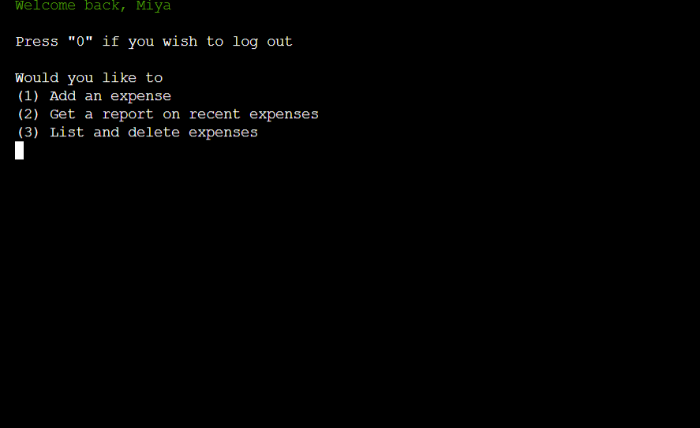

### Register

A feature that allows users to register.

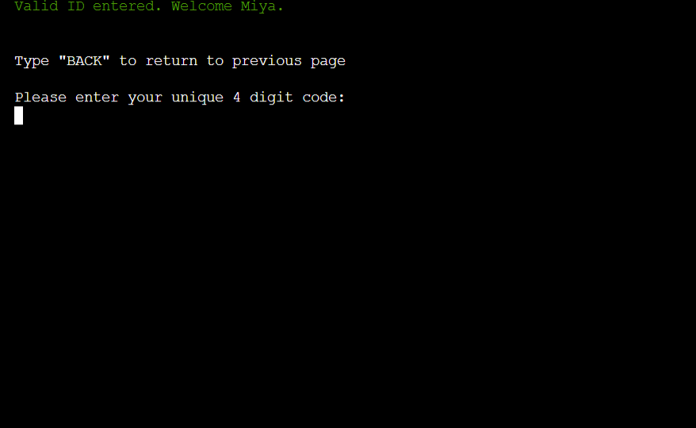

### Expense Menu

Menu where users can navigate between adding, deleting, listing and showing a report of expenses.

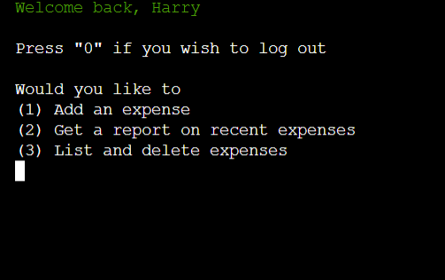

### Add Expense

Feature that let's users add an expense by date, category and amount.

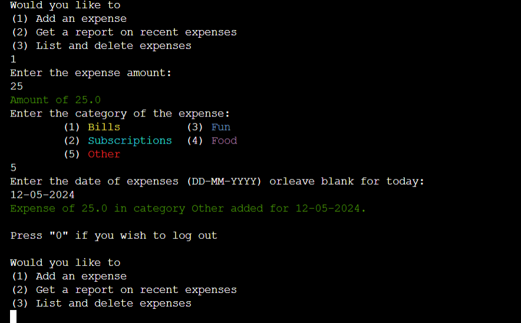

The date can only be added for dates on or after 2010, and only up to a year in the future, allowing users to plan future expenses.

### Show Report

Get a report of expenses sorted by month ands category. This feature sums up all expenses of the same category in the same month to show how much has been spent.

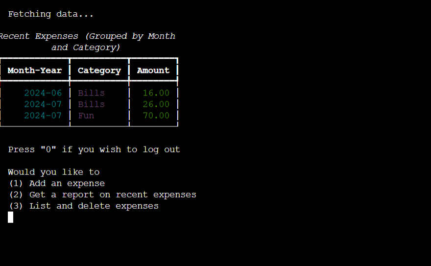

If there is no data the app also tells you this.

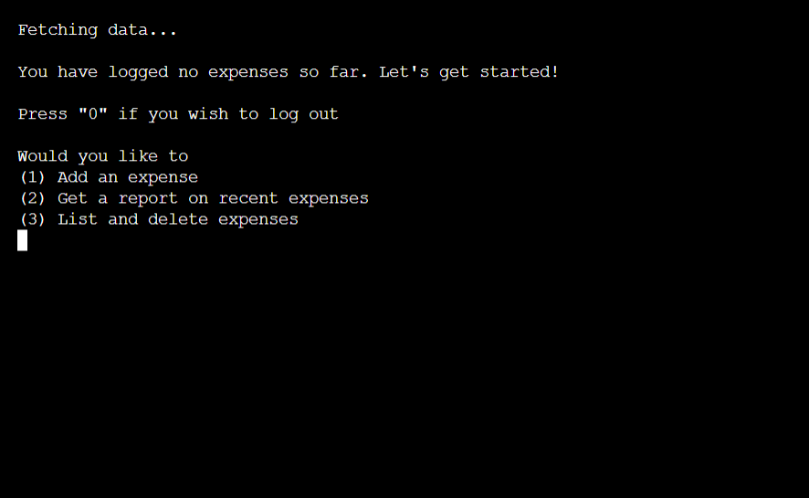

### List expenses

List expenses individually.

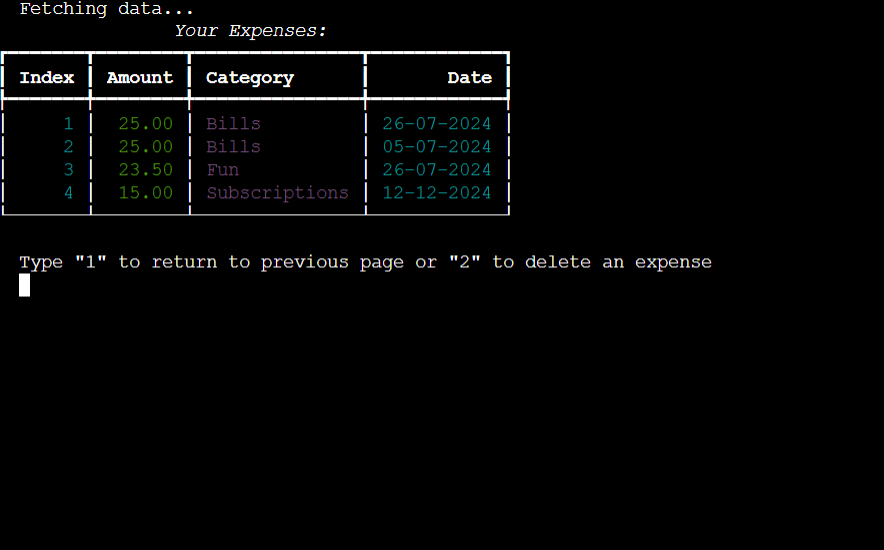

### Delete Expenses

Delete expenses by index.

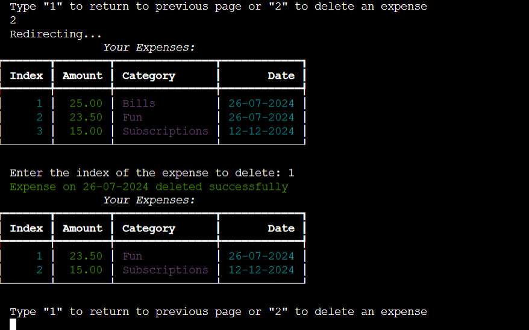

If there is none to delete you or shown a prompt.

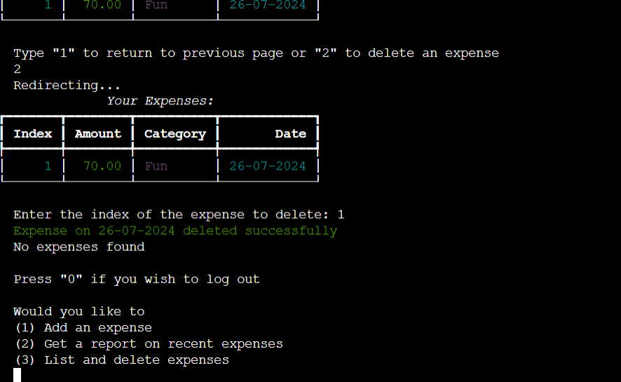

### Logout

Users can press "0" to log out when in the main menu

(This cannot be shown with an image, and videos cannot be shown here.)
### Validation
#### Login Validation

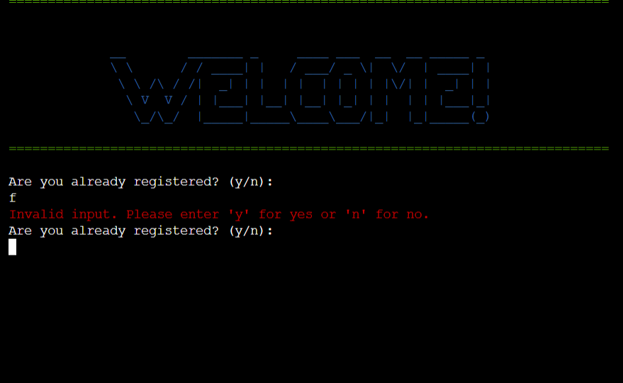

#### Name Validation

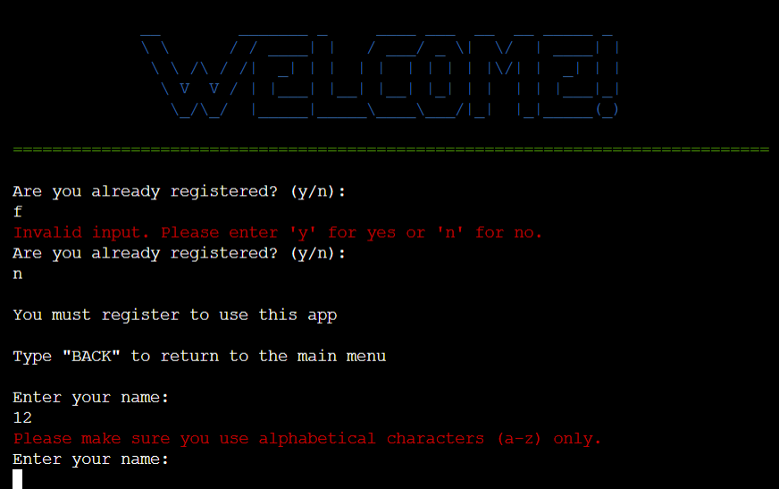

#### ID Validation

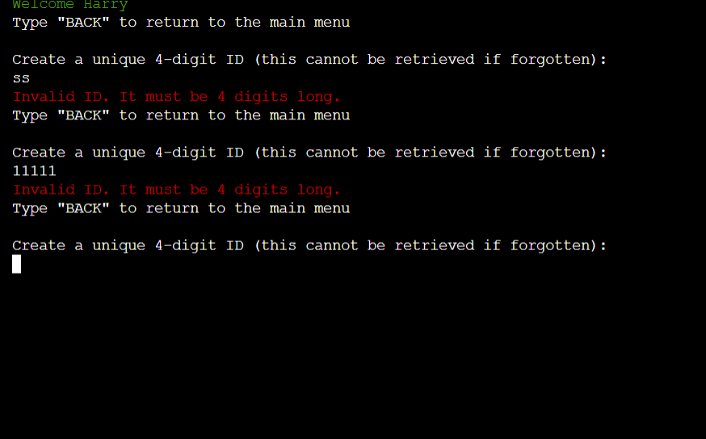

#### ID in Use

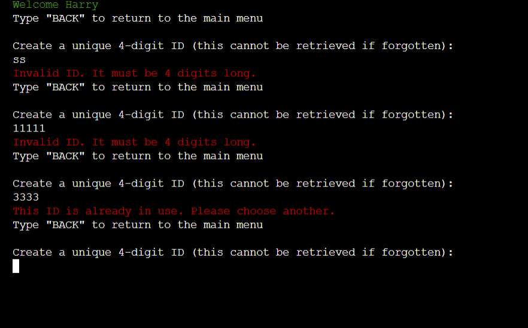

#### No active ID

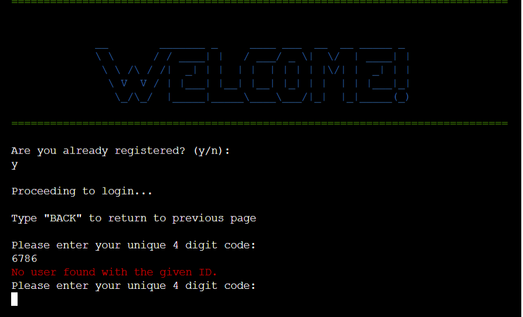

#### Add expense 

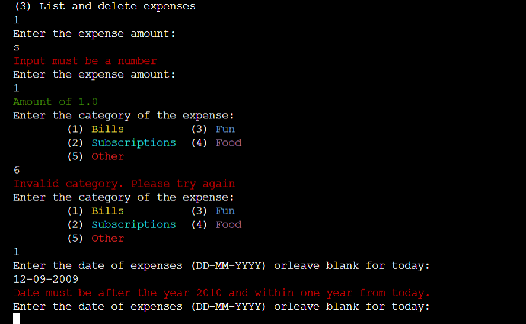

#### List and Delete Expenses

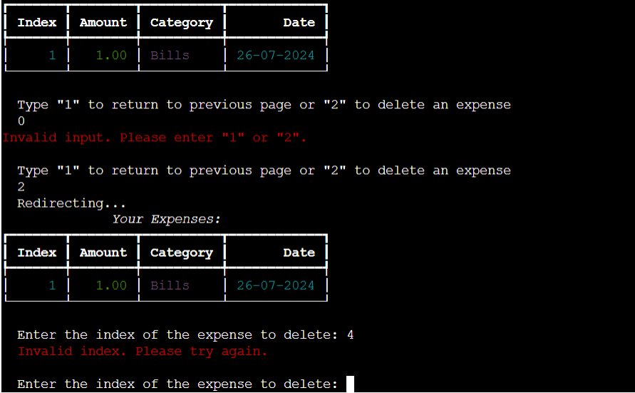

## Design

The design of this app displays a blue ascii art 'Welcome' message, green validation messages for correct inputs and red for incorrect. The Screen also clears in various parts of the app to avoid clutter and keep the path clear.

## Future Deployment

In future deployment, some of the features I wish to add are:
- A more secure log in
- A more secure and complex database
- More options within the menu such as logging balance, taking away from the balance, automated reductions and expenses and more
- Classes and OOP in general to make the code more modern and modular-

## Testing

My testing for this project was carried out in a seperate file below.

[Testing](/TESTING.md)

## Deployment

This site is deployed using Heroku and following these steps:

- Create a Heroku account or, if you already have one, sign in
- Click the 'new' button and select 'create new app'
- Enter a unique name for your app and choose the region you are in
- Click 'create app'
- Click 'settings' and scroll down to 'Config Vars'. Click 'reveal Config Vars'
- In the box with the text 'KEY' type PORT and 8000 in the box with the text 'VALUE'
- Scroll to the next section, buildpacks and click 'add buildpack'. Add Python and NodeJS, in that order. Click 'Add Buildpack'
- Scroll back to the top of the page and click 'Deploy'
- Scroll to the Deployment method and choose Github
- In the next section, Connect to Github, type in your repository name. If you press the search button it'll bring up all your repositories. 
- Connect to the correct repository
- Scroll down to the two sections for deployment (automatic deploys or manual deploys). The automatic deplays will update each time the 'git push' command is entered. For the maunal deploy, this will deploy the branch specified, in it's current state, when the 'Deploy Branch' button is clicked
- Back to top

## Credits
### General Credits
- ChatGPT used to show the report back to the user as this syntax was foreign to me
- [StackOverflow](https://stackoverflow.com/) used to answer questions I encountered with bugs and adding colors to the project
- [Ascii Art](https://www.asciiart.eu/) for the welcome message.

### Libraries
**gspread** - Google Sheets Python API.
  - **Repository:** [gspread on GitHub](https://github.com/burnash/gspread)
  - **Documentation:** [gspread Documentation](https://gspread.readthedocs.io/en/latest/)

**pandas** - Data analysis and manipulation
  - **Repository:** [pandas on GitHub](https://github.com/pandas-dev/pandas)
  - **Documentation:** [pandas Documentation](https://pandas.pydata.org/pandas-docs/stable/)

**colorama** - Colored text API
  - **Repository:** [colorama on GitHub](https://github.com/tartley/colorama)
  - **Documentation:** [colorama Documentation](https://pypi.org/project/colorama/)

**Rich** - `rich` library is used for displaying tables.
  - **Documentation:** [Rich Documentation](https://rich.readthedocs.io/)
  - **GitHub:** [Rich GitHub Repository](https://github.com/Textualize/rich)

**Black** - `black` code formatter is used to ensure consistent code style and formatting throughout the project.
  - **Documentation:** [Black Documentation](https://black.readthedocs.io/)
  - **GitHub:** [Black GitHub Repository](https://github.com/psf/black)

**PEP 8** - PEP 8 is the style guide for Python code used as a standard for writing readable and consistent code.
  - **Documentation:** [PEP 8 Documentation](https://www.python.org/dev/peps/pep-0008/)
  - The project follows PEP 8 guidelines to maintain code quality and readability.

**ASCII Art** - The ASCII art used in this project adds a visually appealing header to the application and enhances the user interface. The ASCII art was created using online tools and resources that generate text art.
  - Online Tool: [ASCII Art Generator](https://www.ascii-art.de/)
  - The art provides a welcoming and engaging entry point for users, making the application feel more personalized and lively.

**Lucidchart** - Lucidchart was used to create detailed diagrams and flowcharts to visually represent the structure and flow of the application. These diagrams aid in understanding the application's architecture, data flow, and user interactions.
- Website: [Lucidchart](https://www.lucidchart.com/)
- The visual aids created with Lucidchart provide clear and concise documentation of the project, making it easier for developers and stakeholders to grasp complex concepts and workflows.

**os** - Part of the Python Standard Library for interacting with the operating system
  - **Documentation:** [os Documentation](https://docs.python.org/3/library/os.html)

**time** - Part of the Python Standard Library for time-related functions (used for sleep())
  - **Documentation:** [time Documentation](https://docs.python.org/3/library/time.html)

**datetime** - Part of the Python Standard Library
  - **Documentation:** [datetime Documentation](https://docs.python.org/3/library/datetime.html)

### Specific Credits
**Clear()** function - [Geeks for Geeks](https://www.geeksforgeeks.org/clear-screen-python/)